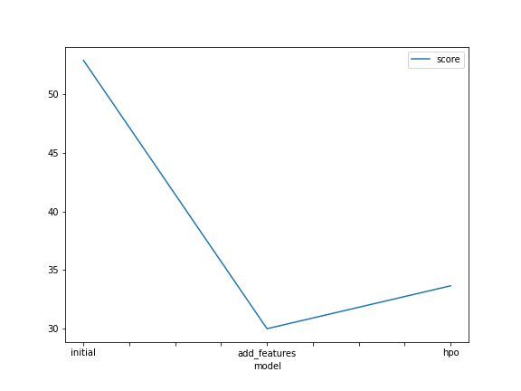
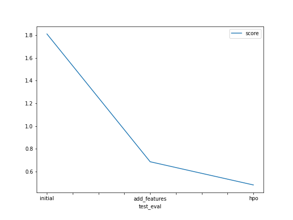

# Report: Predict Bike Sharing Demand with AutoGluon Solution
#### Sara Shaheen 

## Initial Training
### What did you realize when you tried to submit your predictions? What changes were needed to the output of the predictor to submit your results?
After obtaining the predictions, it was important to make sure that all the predictions were greater than or equal to zero prior the submission to Kaggle. Failing to do that will result in rejecting the submission by Kaggle. For the bike sharing predictions, negative results were set to zero before submission. 

### What was the top ranked model that performed?
The top ranked model as denoted by the Root Mean Squared Error Merric (RMSE) is the Weighted_Ensemble_L3 model, as shown in the leaderboard histogram below. It was the top model across all the different trainings made (raw submission, feature engineered and hyperparameter tuned submissions). 

## Exploratory data analysis and feature creation
### What did the exploratory analysis find and how did you add additional features?
A histogram of all features was created to show the distribution of each one relative to the data. This is part of the exploritory data analysis process. This is important as to assess the features distribution is more valuable for regression. All features seemed valid to be part of the training process. 
New features were created as following: 
The date columns was parsed and separeted into individual columns of year, month, day and hour. In addition, season and weather columns data types were transferred to categorical. 

### How much better did your model preform after adding additional features and why do you think that is?
The Kaggle score improved from 1.81144 to 0.68613 which is a huge improvement. In addition model RMSE of the best performing model decreased from 52 to 30 which is again a noticable improvement. I believe adding the parsed time features played a great role in enhancing the preciction. It seems that bike sharing is highly affected by which time of the day riding takes place.

## Hyper parameter tuning
### How much better did your model preform after trying different hyper parameters?
The Kaggle score improved from 0.68613 to  0.48182 after applying the training on the new features and tunning some hyperparamters. However, the RMSE of the best performing model did not change much, it actually got slightly higher.

### If you were given more time with this dataset, where do you think you would spend more time?
I would spend more time on the hyperparamter tunning. There is a wide range of hyperparamters and their unique combination can potentially enhance the accuracy of predictions. 

### Create a table with the models you ran, the hyperparameters modified, and the kaggle score.
|    | model              | hpo1                                                                                                                                                              | hpo2                                                                   | hpo3                                                                                                |   score |
|---:|:-------------------|:------------------------------------------------------------------------------------------------------------------------------------------------------------------|:-----------------------------------------------------------------------|:----------------------------------------------------------------------------------------------------|--------:|
|  0 | initial_model      | default values                                                                                                                                                    | default values                                                         | default values                                                                                      | 1.81144 |
|  1 | add_features_model | default values                                                                                                                                                    | default values                                                         | default values                                                                                      | 0.68613 |
|  2 | hpo_model          | XGB: Estimators[lower=100, upper=500, default=100], max_depth[ ag.space.Int(lower=6, upper=10, default=6], eta (LEARNING RATE): [lower=0.01, upper=0.3, log=True] | GBM: num_boost_round [100], num_leaves[lower=26, upper=66, default=36] | CAT: Iterations[100], learning_rate[lower=0.01, upper=0.3, log=True] , depth [lower=0.01 upper=0.3] | 0.48182 |

### Create a line plot showing the top model score for the three (or more) training runs during the project.

### Create a line plot showing the top kaggle score for the three (or more) prediction submissions during the project.

## Summary
In summary, this educational project was designed to assist learners getting to implement various data exploratory and feature engineering techniques and hyperparamters optimization through modern platforms such Autogluon. Enhancing the performance of a predictve model is an iterative process that involves trying new models, new features and different hyperparamter values. Below is what I believe are the pillars towards designing a machine learning predictive model:
1. Good quality data with proper splitting of training and testing.
2. Proper Exploratory data analysis and feature engineering techniques.
3. Training and fitting the data using muliple models (such as, Linear regression, tree based, random forest, XGBOOST, Autogluon).
4. Using proper validation and model scoring metrics 
All of the previous steps are to be performed in an iterative way with lots of patience and dedication until achieving satisfying validation and scoring. 

